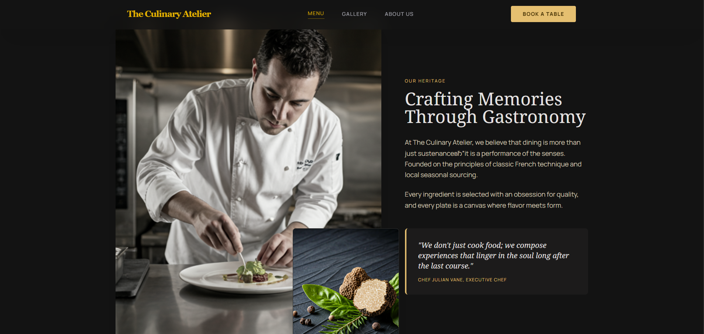

# Landing Pages Collection

A collection of three responsive landing pages built with HTML, Tailwind CSS, custom CSS, and small page-level JavaScript files. Each page is organized as a standalone mini-project with its own markup, custom styles, script entry point, and Tailwind configuration.

## Pages

### Kinetic Edge - Fitness Landing Page

Dark, high-contrast landing page for an elite fitness and training studio. It uses bold typography, neon accents, large image sections, program cards, trainer profiles, testimonials, pricing tiers, and a strong final call to action.

Open page: [`fitness/index.html`](./fitness/index.html)

Screenshot:



### Neon Logic - IT Landing Page

Modern digital agency landing page for a product design and technology studio. It includes a centered hero section, service cards, glassmorphism panels, gradient buttons, and a project inquiry form.

Open page: [`it/index.html`](./it/index.html)

Screenshot:


### The Culinary Atelier - Restaurant Landing Page

Elegant restaurant landing page for a fine dining concept. It includes a cinematic hero, restaurant story section, signature menu highlights, gallery, reservation form, and refined typography.

Open page: [`rest/index.html`](./rest/index.html)

Screenshot:


## Project Structure

```text
Landing-Pages/
|-- fitness/
|   |-- index.html
|   |-- styles.css
|   |-- script.js
|   |-- tailwind.config.js
|   `-- README.md
|-- it/
|   |-- index.html
|   |-- styles.css
|   |-- script.js
|   |-- tailwind.config.js
|   `-- README.md
|-- rest/
|   |-- index.html
|   |-- styles.css
|   |-- script.js
|   |-- tailwind.config.js
|   `-- README.md
`-- README.md
```

## Tech Stack

- HTML5
- Tailwind CSS CDN
- Custom CSS
- Vanilla JavaScript
- Google Fonts
- Material Symbols

## How To View

Open any page directly in the browser:

- `fitness/index.html`
- `it/index.html`
- `rest/index.html`

No build step or local server is required because the pages use the Tailwind CDN.

## Screenshots

Screenshots are stored inside each page folder:

```text
fitness/image.png  - fitness page
it/image.png       - IT page
rest/image.png     - restaurant page
```
